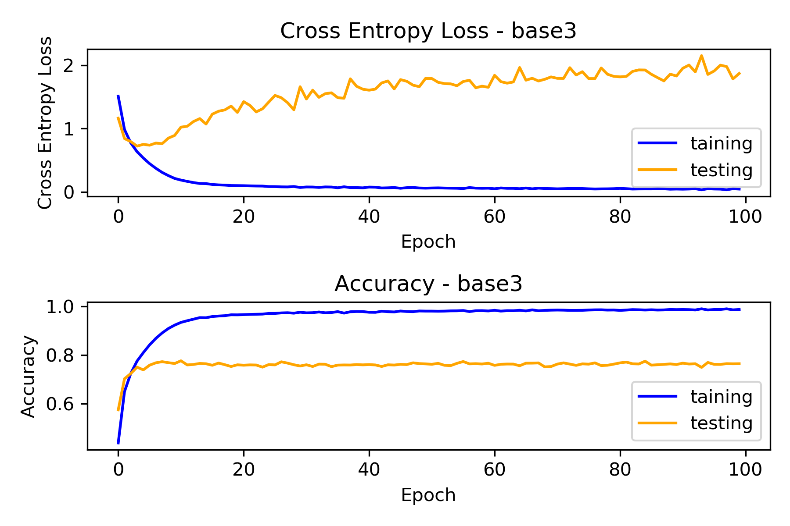
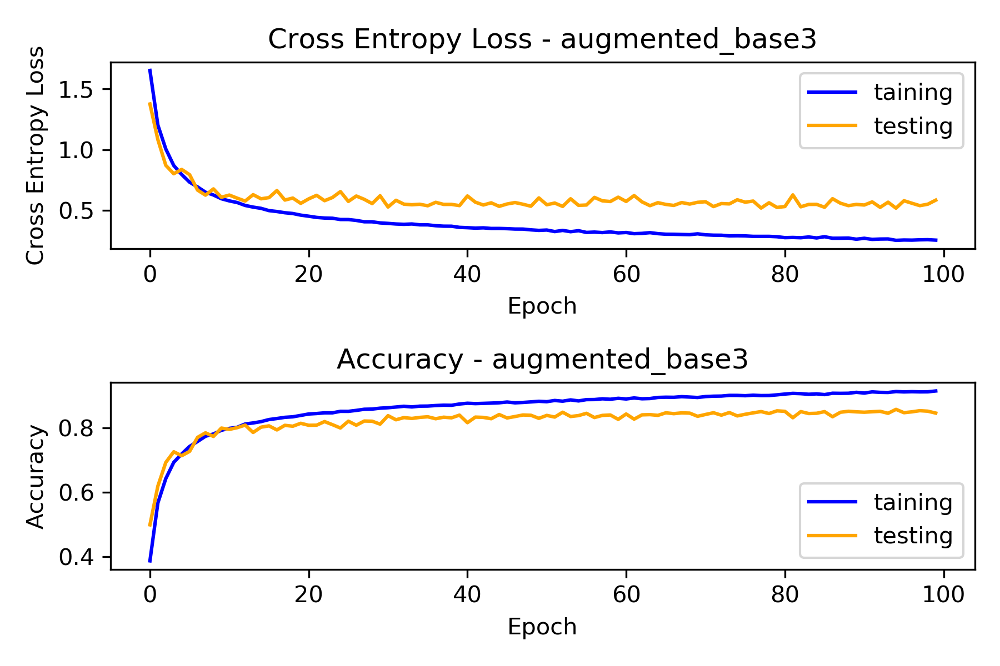
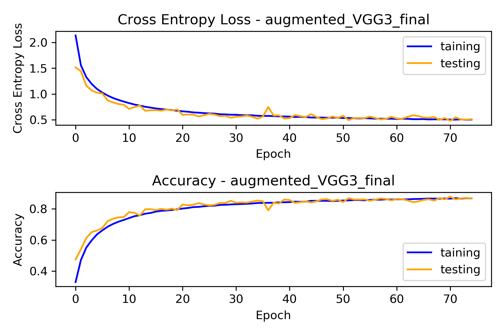
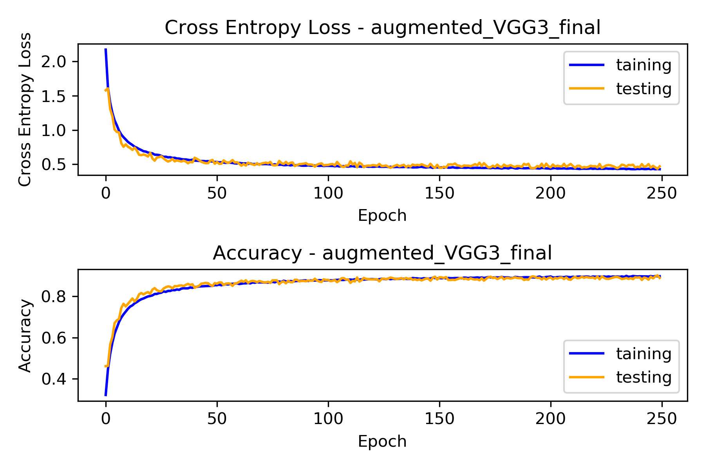
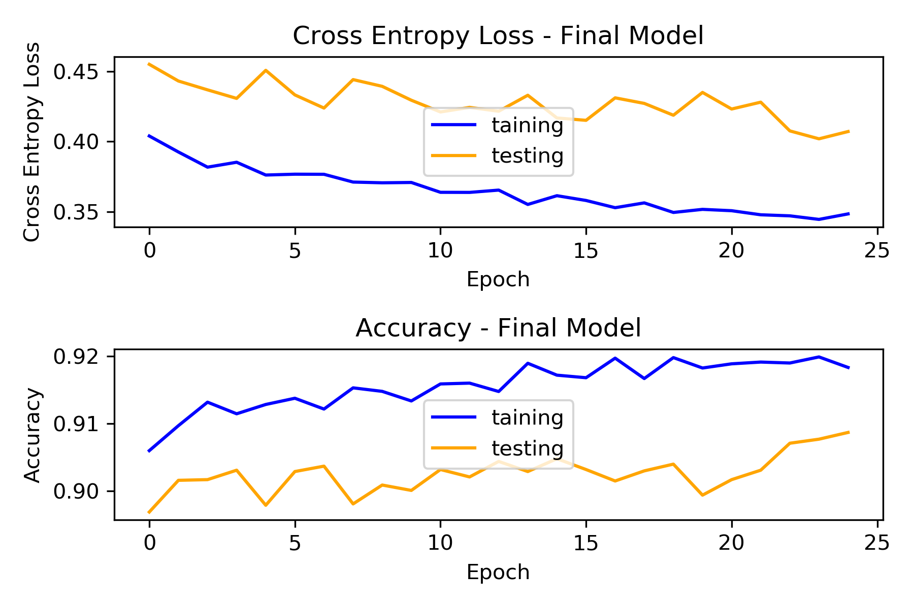
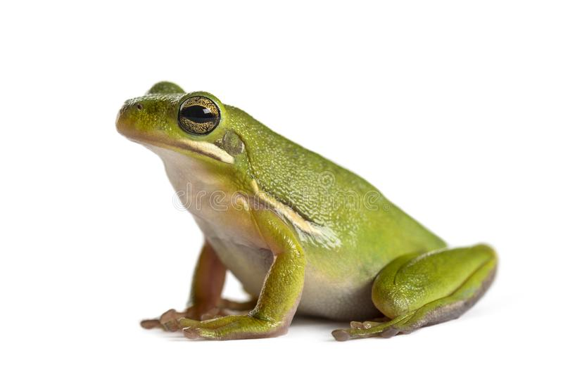
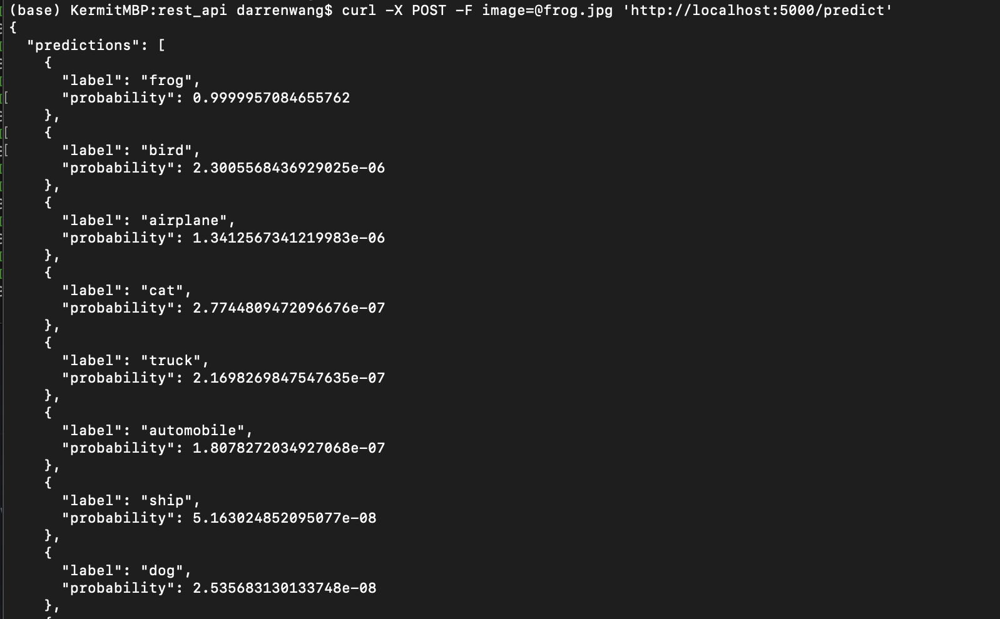

## End-to-End Image Classification Model Development

In this repository, a lightweight deep learning model was trained on the CIFAR10 dataset to classify images into 10 objects. The final model achieved 90% accuracy on 10,000 testing images. The model architecture was inspired by [Karen Simonyan, Andrew Zisserman
 - Very Deep Convolutional Networks for Large-Scale Image Recognition](https://arxiv.org/abs/1409.1556). A simple REST API built with Flask was used for model deployment.

<!-- TABLE OF CONTENTS -->
<summary><h2 style="display: inline-block">Table of Contents</h2>
  <ol>
    <li>
      <a href="#model-development">Model Development</a>
    </li>
    <li>
      <a href="#rest-api">Model Deployment with REST API</a>
      <ul>
        <li><a href="#installation">Installation</a></li>
      </ul>
    </li>
    <li><a href="#rest-api-usage">Usage</a></li>
    <li><a href="#acknowledgements">Acknowledgements</a></li>
  </ol>
</details>


<!-- ABOUT THE PROJECT -->
## Model Development

The model was developed on the CIFAR-10 dataset consists of 60,000 32x32 pixels colored images in 10 classes, with 6000 images per class. There are 50000 training images and 10000 test images. For more information, visit: https://www.cs.toronto.edu/~kriz/cifar.html. Centering each pixel was the only preprocessing step taken before model training.

Also, This tech report (Chapter 3) describes the dataset and the methodology followed when collecting it in much greater detail. [Learning Multiple Layers of Features from Tiny Images, Alex Krizhevsky, 2009.](https://www.cs.toronto.edu/~kriz/learning-features-2009-TR.pdf)

Models were trained using AWS EC2, with a p3.x2large instance. All code used for model training can be found in cifar10_CNN.ipynb, and cifar10_model_training.ipynb

The model architecture were inspired by [Karen Simonyan, Andrew Zisserman, 2014](https://arxiv.org/abs/1409.1556). This paper examined very deep ConvNet models with very small (3x3) convolution filters in the large-scale image recognition setting. Their results are the famous VGG16/VGG19 models.

A VGG layer is defined as:

```python
model.add(Conv2D(32, (3, 3), strides=1, padding='same', activation='relu'))
model.add(Conv2D(32, (3, 3), strides=1, padding='same', activation='relu'))
model.add(MaxPooling2D(2, 2))
```

Since our problem here is much simpler than the one in the paper. Shallower models with 1 to 3 VGG layers followed by 2 dense layers were examined as baseline models.



Each model achieved almost 100% in training but only got around 70% in testing, which signals over-fitting. However, high accuracy in training indicates our baseline models are able to pick up structures in the dataset and 3 VGG layers may be sufficient to our problem. Baseline model with 3 VGG layers were selected to proceed with because it was able to get the highest testing accuracy out of the three baseline models. In addition, it takes almost neglectable extra computation time to train comparing to 1 and 2-layers model(under 2 mins difference for training 100 epochs).

To reduce overfitting, it seems like ConvNet-Relu-BatchNorm is a common triplet widely used in image recognition. BatchNorm layers can also act as a regularizer in our case. Other than BatchNorm, L2 regularization, DropOut layers, and data augmentation were also examined. I used Kera's ImageDataGenerator to perform data augmentation on the fly. Configured as below, because our images are low resolution, milder data augmentation was used.

```python
datagen = ImageDataGenerator(
    rotation_range=10,
    width_shift_range=0.1,
    height_shift_range=0.1,
    horizontal_flip=True)
```



Out of four methods tried, data augmentation raised testing accuracy by the most, from 70% to 84%. The other methods, BatchNorm, L2 regularization, and DropOut, were also able to increase the accuracy by 12%, 5%, and 9%, separately. However, only data augmentation was able to let the model increase testing accuracy continuously by observable amount after 20~30 epochs.



Combining every regularize approach above, and using a 0.001 learning rate, the model achieved 86.25% testing accuracy. Normalization, as an alternative to the centering preprocessing step we took earlier, was also evaluated with the same model architecture and turned out normalization was able to achieve a slightly better result of 87.33%. I decided to switch to normalization. Also, with a few tries, I opted to use 0.0003 as the learning rate for a 250 epochs model.



The model ended up at 88.9% testing accuracy, but achieved 90.14% at the 249th epochs, the accuracy wiggled around 89% at the last 30 epochs so I decided to lower the learning rate to 0.0001 and let the model run for 25 extra epochs, and see if the model can hit 90% consistently.



The model hit 90% consistently in the 25 extra epochs. This is the final model and we will use this model to build our REST API. It's worth notice that one might be able to get even better accuracy with better learning rate scheduling.

<!-- REST API -->
## REST API

Codes in this section was mainly taken from [Building a simple Keras + deep learning REST API] (https://blog.keras.io/building-a-simple-keras-deep-learning-rest-api.html) with little modification. All codes and final model for the REST API can be found in rest_api folder under this repository.

Using Flask, a /predict endpoint was set up to accept POST requests with image for classification. Our API would resize and preprocess uploaded image, and feed it to our model to make prediction.

### Installation

1. Clone the repo
   ```sh
   git clone https://github.com/TheKermitFrog/cifar10-CNN.git
   ```
2. Install Prerequisites
    ```sh
    pip install requirements.txt
    ```

<!-- USAGE EXAMPLES -->
## REST API Usage

Open up terminal and run:

  ```sh
 python app.py
  ```
Use cURL to send a post request:

  ```sh
  curl -X POST -F image=@frog.jpg 'http://localhost:5000/predict'
  ```

Example:

Using the frog pic in rest_api folder:



Prediction returned: 



<!-- ACKNOWLEDGEMENTS -->
## Acknowledgements

* [Karen Simonyan, Andrew Zisserman, Very Deep Convolutional Networks for Large-Scale Image Recognition](https://arxiv.org/abs/1409.1556)
* [Building a simple Keras + deep learning REST API](https://blog.keras.io/building-a-simple-keras-deep-learning-rest-api.html)
